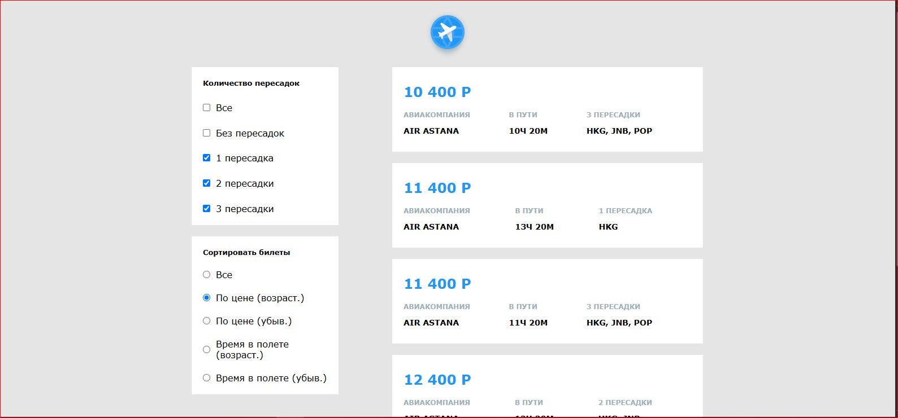

# Авиабилеты с фильтрацией и сортировкой (React)

  

SPA на React, демонстрирующий интерактивный список авиабилетов с возможностью фильтрации и сортировки.

## Особенности проекта
- Фильтрация билетов по количеству пересадок (0–3) через чекбоксы.
- Сортировка по цене и времени в пути (возрастающая / убывающая).
- Адаптивный интерфейс с использованием CSS-анимаций.
- Структура приложения через переиспользуемые компоненты:
  - Main — контейнер страницы
  - Content — отображение отдельных билетов
  - Transplants и Tickets — фильтры и сортировка
- Работа с состоянием через хуки useState и useEffect.

## Стек технологий
- React (функциональные компоненты + хуки)
- CSS (стили и анимации)
- Работа с массивами объектов (map, filter, sort)

## Навыки, демонстрируемые в проекте
- Разделение UI на компоненты
- Управление состоянием и обработка событий
- Фильтрация и сортировка данных
- Адаптивная верстка и интеграция изображений

## Демо
[Ссылка на рабочий билд](https://radiant-pixie-ed4c7d.netlify.app)
